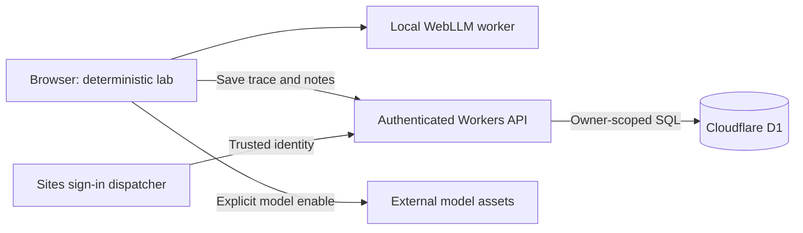

# Product architecture

Interleave combines a public concurrency lab, optional local AI, and private saved investigations. The first product audience is developers learning to reason about concurrent behavior. It does not ingest or analyze production repositories.

## Boundaries

- `lib/engine.ts`, `lib/experiments.ts`, and replay/session modules implement deterministic teaching models independently of React.
- `features/lab` renders the lab and loads the assistant on demand.
- `features/assistant` owns local model initialization, bounded trace context, streaming, and the chat interface. There is no hosted inference endpoint or shared GPU bottleneck.
- `features/workspace` owns save/list/edit/delete flows. A saved investigation is an immutable experiment/mode/schedule plus editable title and notes.
- `app/api` validates HTTP requests and authentication. `server/investigations.ts` owns parameterized SQL. `lib/investigations.ts` defines strict input schemas.
- `db/schema.ts` defines the schema. Generated SQL migrations in `drizzle/` are committed and applied at deployment.

## Identity and data ownership

The public lab and local AI are anonymous. Saving requires Sign in with ChatGPT through the Sites dispatcher. `app/chatgpt-auth.ts` reads the dispatcher-provided user ID and email. It never accepts identity from JSON or a query parameter. Sign-in and sign-out use top-level navigation, preserving the current replay on sign-in.

The application relies on Sites to strip spoofed identity headers and supply authenticated headers. Do not expose the worker directly behind a proxy that forwards client-controlled `oai-authenticated-*` headers. A different hosting provider requires an actual session verifier before these handlers can be reused safely. The local Sites integration supplies a test identity for development; it is not production authentication.

Every select, update, and delete is scoped to the authenticated owner. Cross-account access returns 404. An owner index supports the bounded investigation list. Private API responses use `Cache-Control: private, no-store`. Mutation endpoints require a matching Origin and JSON where a body is expected. The API never returns stored owner IDs.

Saved data includes account ID, title, experiment ID, mode, schedule, notes, timestamps, and revision. Email is read for authentication and display, not stored in the investigation table. Deleting a record removes it from the application's active database; provider backup retention is outside this application. No public notes-sharing feature exists. Replay links include only the modeled execution; exported Markdown is controlled by the person downloading it.

## Limits and conflict handling

Each account can save 50 investigations. The quota check and insert are one SQL statement. Titles are at most 100 characters, notes 10,000, replay traces 64 steps, and request bodies 48,000 bytes. Unsupported fields and impossible traces are rejected. Lists are bounded by the account quota, so pagination is not needed at this limit.

Each record starts at revision 1. Editing uses an expected `version`; deleting uses the displayed revision in `If-Match`. The SQL predicate includes owner, ID, and revision, then increments the revision on an edit. A stale revision returns 409 and the interface asks the user to reload. This is a first-party API contract; its integer `If-Match` value is not a general HTTP entity-tag implementation.

## API

| Endpoint | Contract |
| --- | --- |
| `GET /api/session?returnTo=/workspace` | Signed-in state and validated local sign-in URL |
| `GET /api/investigations` | Current owner's investigations, newest first |
| `POST /api/investigations` | `{title, experimentId, mode, trace, notes}`; returns 201 |
| `GET /api/investigations/:id` | Current owner's record |
| `PATCH /api/investigations/:id` | `{title, notes, version}`; rejects stale revision |
| `DELETE /api/investigations/:id` | Integer expected revision in `If-Match` |
| `GET /api/health` | 200 when the investigation table exists; otherwise 503 |

Expected errors use 400 for invalid values, 401 for missing identity, 403 for an invalid Origin, 404 for missing or inaccessible records, 409 for quota or revision conflicts, 413 for oversized bodies, and 415 for the wrong body type. Unexpected failures return a generic 503 with a request ID. Application error logs contain error type and request ID, not request bodies or notes.

## Develop and deploy

1. Install the pinned dependencies with `pnpm install --frozen-lockfile` on Node 22.13+.
2. Run `pnpm db:migrate:local` to create the local D1 schema, then `pnpm dev`.
3. Open `/workspace` and use the local sign-in flow to exercise the development identity. The lab needs no login.
4. For a schema change, edit `db/schema.ts`, run `pnpm db:generate`, review the generated SQL, and apply it locally. Never rewrite a migration already applied to production.
5. Run `pnpm check` and `pnpm build`.
6. Deploy through Sites with your own project registration, the logical `DB` binding, and generated migrations. The published artifact must include the Worker output, client assets, hosting metadata, and `drizzle` migrations. No AI API secret is required.
7. Check `/api/health`, the anonymous lab, anonymous API denial, and the signed-in workspace. A healthy schema check does not establish that every feature or identity flow works.

`wrangler.local.json` uses the same placeholder D1 identifier as the Vite development configuration. Local state stays in ignored `.wrangler/`; do not commit it. The public demo's `.openai/hosting.json` project ID is not a credential and does not grant deployment access.

## Validation and scaling boundaries

The suite includes independently reasoned engine regressions and real SQLite execution of production store statements. Workspace tests cover owner isolation, quota enforcement, revision conflicts, strict inputs, body limits, and cross-origin rejection. Provider lifecycle tests use a mocked GPU runtime. Type checking, authored-source linting, and a production build run in CI. Local HTTP integration verified sign-in simulation and the full create/read/update/delete flow. Actual browser GPU inference and production user sign-in have not been automated or verified in that local flow.

Simulation and AI consume client resources; static assets can be cached independently of dynamic requests. The API is stateless and uses bounded indexed database operations. These choices support growth without requiring a server-side model per visitor, but there has been no load test and no throughput guarantee. D1 has finite database, request, and write-concurrency limits. Per-account storage caps do not rate-limit request frequency or account creation.

Before a high-traffic launch, measure API latency and D1 read/write consumption under a representative workload, add hosting-level abuse/rate controls, and verify backup/restore operations. Before paid or team use, add organization membership and roles, audit history, explicit retention/export controls, operational alerts, and billing. Increasing the quota should include cursor pagination and a database sizing review. These capabilities are future work, not shipped features.
